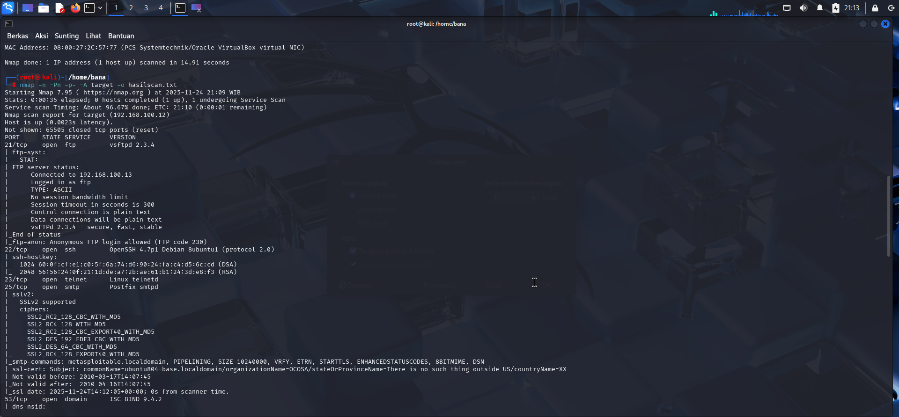
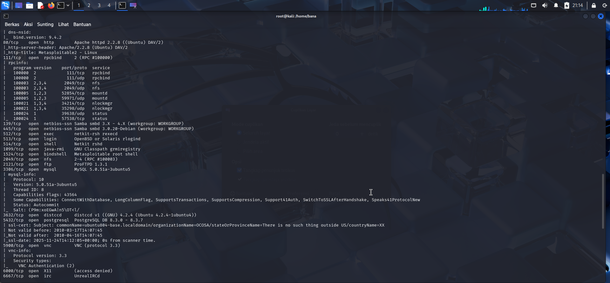
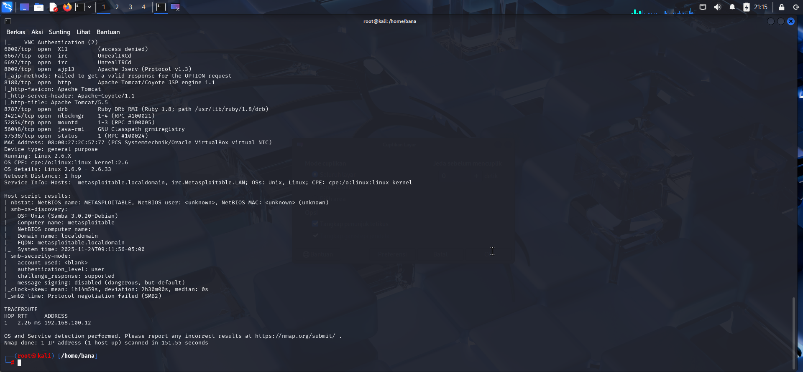

# 🛡️ Laporan Hasil Scanning Nmap — Metasploitable2

## 📌 Informasi Target
IP Address : **192.168.100.12 target**
Hostname : **target**
Command : `nmap -n -Pn -p- -A 192.168.100.12 (target) -o hasil_scan.txt` (Contoh Komprehensif)

---

# 🔍 Ringkasan Port Terbuka

| Port | Status | Service | Keterangan |
|------|--------|-----------------------------|------------|
| **21** | open | **ftp — vsftpd 2.3.4** | Anonymous login allowed & *backdoor exploit* tersedia. |
| **22** | open | **ssh — OpenSSH 4.3p2** | Versi lama → rentan *brute force* & *exploit* publik. |
| **23** | open | **telnet** | Tidak terenkripsi → kredensial dapat dicuri. |
| **25** | open | **smtp — Postfix smtpd** | Layanan SMTP terbuka. |
| **53** | open | **dns — ISC BIND 9.4.2** | Versi lama, potensi *DNS Cache Poisoning*. |
| **80** | open | **http — Apache httpd 2.2.8** | Halaman web Metasploitable2. |
| **111** | open | **rpcbind** | Digunakan untuk *pivoting* dan enumerasi NFS/RPC. |
| **139** | open | **netbios-ssn (Samba)** | Versi Samba rentan. NetBIOS Name: `METASPLOITABLE`. |
| **445** | open | **netbios-ssn Samba smbd 3.x-4.x** | Versi Samba rentan. |
| **512** | open | **exec (rsh)** | Remote login tanpa *password* jika `.rhosts` salah konfigurasi. |
| **513** | open | **login (rshd)** | Sangat berbahaya, bagian dari RSH suite. |
| **514** | open | **shell (rsh)** | Login remote tidak aman. |
| **1099** | open | **java-rmi GNU Classpath** | Rentan *remote code execution* (RCE). |
| **1524** | open | **bindshell Metasploitable root shell** | **CRITICAL:** *Root backdoor shell* terbuka. |
| **2049** | open | **NFS (Network File System)** | Akses *filesystem* rawan jika tidak dikonfigurasi dengan benar. |
| **2121** | open | **ftp — ProFTPD 1.3.1** | Potensi *reverse shell exploit* (mod_copy). |
| **3306** | open | **MySQL 5.0.51a** | Sering tanpa *password default* atau lemah. |
| **3632** | open | **distccd v1** | Rentan *Remote Command Execution* (RCE). |
| **5432** | open | **PostgreSQL 8.3.0 - 8.3.7** | Versi lama, *brute force risk*. |
| **5900** | open | **VNC (protocol 3.3)** | Tidak terenkripsi, rentan *brute force*. |
| **6000** | open | **X11** | Bisa membaca *input keyboard/mouse*. |
| **6667** | open | **irc UnrealIRCd** | *Backdoor* terkenal (CVE-2010-2075) tersedia. |
| **8009** | open | **AJP13** | Rawan *Local File Inclusion* (LFI) atau *upload shell* (dengan miskonfigurasi). |
| **8180** | open | **http Apache Tomcat/Coyote** | Default admin credentials (Tomcat 5.5). |

---

# ⚠ Kesimpulan Keamanan

Target *192.168.100.12* memiliki **lebih dari 30 port terbuka** dan hampir seluruh *service* menggunakan **versi lama (Outdated)** serta memiliki **eksploit publik** yang tersedia luas.

Ini adalah tanda khas **Metasploitable2**, sebuah sistem yang dirancang secara *vulnerable* untuk tujuan pelatihan *penetration testing* dan edukasi keamanan. Sistem ini harus dianggap sebagai **berisiko kritis** dan tidak boleh ditempatkan pada jaringan produksi.

---

# 🧨 Kerentanan Paling Kritis

### 🔥 1. Remote Code Execution (RCE)
Celah ini memungkinkan penyerang mengeksekusi perintah pada sistem target.
- **Bindshell (1524):** Akses *root* langsung.
- **distccd (3632):** RCE tanpa autentikasi.
- **vsftpd 2.3.4 (21):** *Backdoor* RCE.
- **UnrealIRCd (6667):** RCE melalui *backdoor* yang tersembunyi.

*Dampak:* Kendali penuh (**Full system compromise**).

### 🔥 2. Credential Leak / Tanpa Password
- **FTP Anonymous (21):** Penyerang dapat login tanpa otentikasi.
- **Telnet (23):** Kredensial dikirim tanpa enkripsi (plain text).
- **RSH Suite (512, 513, 514):** Login remote tanpa *password* dimungkinkan jika `.rhosts` salah konfigurasi.

*Dampak:* Penyerang dapat login dan mengambil data sensitif.

### 🔥 3. Web Exploitation
- **Apache Tomcat (8180):** Potensi akses dengan *default credentials*.
- **AJP13 (8009):** Rawan LFI atau RCE.

*Dampak:* *Upload malicious shell*, *takeover webserver*.

---

# 📊 Tabel Risiko

| No | Risiko | Layanan Terdampak | Dampak |
|----|--------|-------------------|--------|
| 1 | Remote Code Execution | Bindshell, vsftpd, distccd, UnrealIRCd | Full system compromise |
| 2 | Credential Leak | FTP, Telnet, RSH | Password bocor, akses tidak sah |
| 3 | Web Exploitation | Apache, Tomcat, AJP13 | Upload malicious shell |
| 4 | Outdated Services | OpenSSH, MySQL, PostgreSQL, Samba | Exploit tersedia publik |
| 5 | Enumeration & Pivoting | RPC, NFS, Samba | Mempermudah eksploitasi lanjutan |

---
Di Buat Oleh : **Sertu Pom Bana Ridho W**